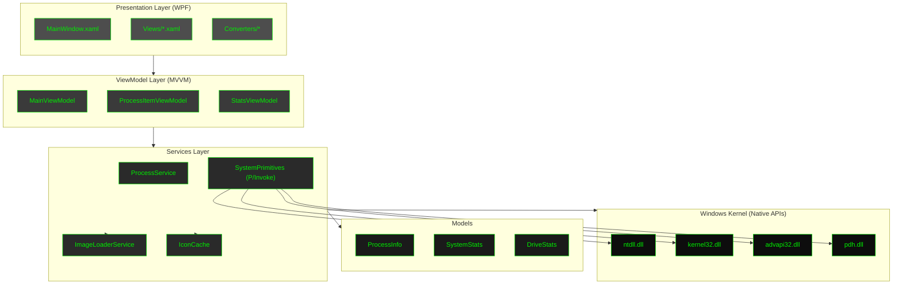
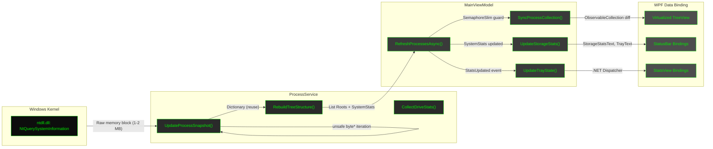
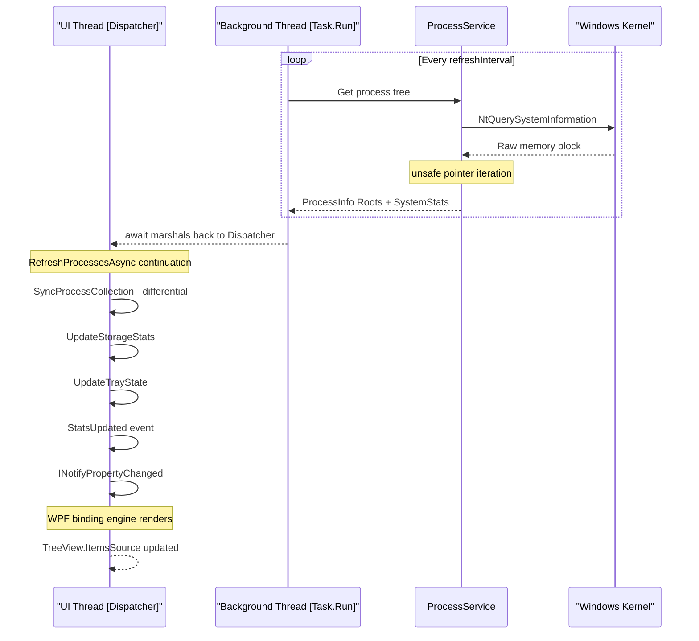
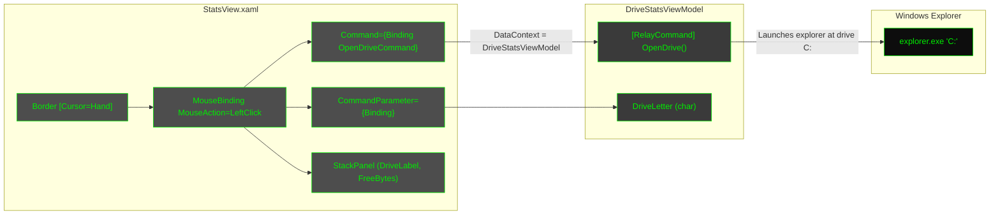
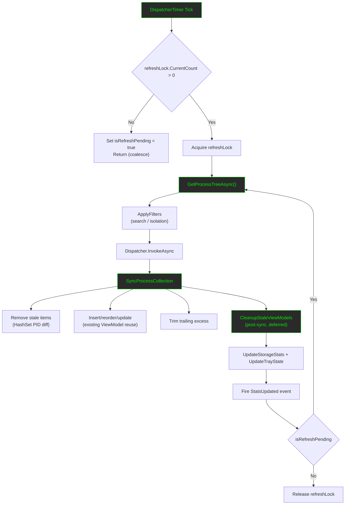
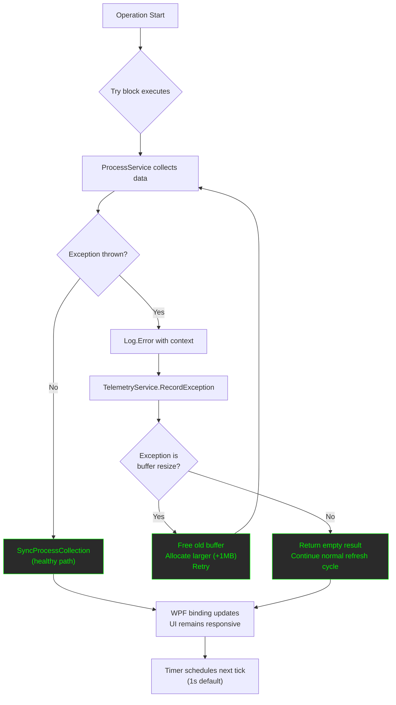

<p align="center">
  <a href="#" target="_blank">
    
  </a>
</p>

# SystemProcesses

**A high-performance, zero-allocation system monitor built with .NET 10 and WPF.**

  

`SystemProcesses` is a lightweight Task Manager alternative engineered for minimal resource usage. Unlike standard tools that rely on the heavy `System.Diagnostics.Process` API, this project interacts directly with the Windows Kernel (`ntdll.dll`) to scrape system data with near-zero garbage collection overhead.

## Key Features

- **Extreme Performance:** Uses `NtQuerySystemInformation` to fetch the entire process tree in a single system call (< 5ms latency).
- **Zero-Allocation Architecture:**
  - Reuses `ProcessInfo` objects and internal buffers across update cycles.
  - Uses `stackalloc` and `Unsafe` pointer arithmetic for parsing kernel structures.
  - Implements `StringBuilderPool` for string formatting.
- **Optimized UI Rendering:**
  - Custom `SyncProcessCollection` algorithm updates WPF ViewModels in-place to prevent UI flickering and object churn.
  - Virtualized `TreeView` handles thousands of nodes efficiently.
- **Resource Efficiency:**
  - **Icons:** Extracted once, frozen, and cached using `ImageLoaderService`.
  - **Strings:** `PidText` and other static strings are cached to avoid boxing.
- **Always-On-Top Stats Window:** Optional StatsView overlay displays real-time system statistics (CPU, RAM, VM, Disk, Drive free space) above the taskbar using message-driven Win32 enforcement.
- **Modern Stack:** Built on .NET 10, utilizing `LibraryImport`, `Span<T>`, and the MVVM Toolkit.
- **Snapshot Export:** Export the current process tree to **CSV**, **JSON** (nested hierarchy), or **Markdown** with a LiteDialog-style picker. Choose **Full** (entire snapshot) or **Visible** (only the processes currently shown after search/isolation).

## Architecture & Optimizations

This project demonstrates advanced .NET systems programming techniques:

### 1. Kernel Interop (`SystemPrimitives.cs`)

Instead of the slow `System.Diagnostics` API, we use **P/Invoke** to call undocumented Windows APIs.

- **`NtQuerySystemInformation`**: Retrieves a raw memory block containing all process data.
- **`EnumServicesStatusExW`**: Maps Service IDs to PIDs directly from the Service Control Manager.
- **`PdhAddEnglishCounterW`**: Reads "PhysicalDisk(\_Total)\% Idle Time" for accurate I/O stats.

### 2. Memory Management (`ProcessService.cs`)

- **Manual Buffering:** Allocates unmanaged memory (`Marshal.AllocHGlobal`) for kernel data, resizing only when necessary.
- **Pointer Arithmetic:** Iterates over the raw byte stream using `unsafe` pointers to extract data without marshalling full structures.
- **Struct Reuse:** The `activeProcesses` dictionary updates existing instances. New allocations only occur when a _new_ process starts.

### 4. Snapshot Export (`Services/Export/`, `Helpers/ExportDialog.cs`)

Export the running process tree to disk without third-party libraries or reflection:

- **Formats:** CSV (flat, RFC-4180 quoted), JSON (hand-written nested `children` tree), Markdown table. All meta fields are included (PID, CPU, memory, threads, handles, service flag, parent PID, path, command line, create time).
- **Mode:**
  - **Full** — the entire latest snapshot (ignores search/isolation filters). Captured as an immutable deep clone under the refresh lock, so the async render cannot race a live refresh.
  - **Visible** — only the processes currently displayed (search + isolation applied).
- **Extension sync:** Selecting a format radio rewrites only the output file extension; the base file name and directory are preserved.
- **Performance:** Rendering runs off the UI thread (`Task.Run`) and writes via `File.WriteAllTextAsync`; the UI never blocks on I/O. Writers reuse `StringBuilderPool` and emit directly, keeping allocations minimal.

### 3. Thread-Safe UI (`MainViewModel.cs`)

- **Producer-Consumer:** The `ProcessService` runs on a background thread.
- **Synchronization:** A `SemaphoreSlim` ensures only one refresh cycle runs at a time.
- **Differential Updates:** The UI layer compares the new data snapshot against the existing `ObservableCollection`, adding/removing/updating only what changed.

## Architecture Diagrams

### Layered Architecture



### Process Data Pipeline



### Threading Model



### Drive Widget Click-to-Open (StatsView)



### Refresh Cycle — Differential Update



### Error Handling & Recovery



## Requirements

- **OS:** Windows 10 / 11 (x64 recommended)
- **Runtime:** .NET 10.0 Runtime
- **Rights:** Administrator privileges are recommended for full visibility (e.g., viewing details of System processes).

## Quick Start

### Build from Source

```bash
# 1. Clone the repository
git clone https://github.com/ahmadmdabit/SystemProcesses.git
cd SystemProcesses

# 2. Restore dependencies
dotnet restore

# 3. Build in Release mode (Recommended for performance)
dotnet build -c Release

# 4. Run
dotnet run --project SystemProcesses.Desktop -c Release
```

### Configuration

The application is designed to work out-of-the-box.

- **Refresh Rate:** Adjustable via the UI toolbar (Default: 1s).
- **Logging:** Logs are written to `logs/SystemProcesses-.log` using Serilog (Async/File sink).

## User Guide

For detailed usage instructions, feature breakdowns, and troubleshooting, please refer to the [User Guide](UserGuide.md).

## Project Structure

- **`Services/`**
  - `ProcessService.cs`: Core engine. Handles P/Invoke and data parsing.
  - `SystemPrimitives.cs`: Native API definitions (`[LibraryImport]`).
  - `ImageLoaderService.cs`: Async, cached, thread-safe image loading.
  - `IconCache.cs`: GDI+ icon extraction and freezing.
- **`ViewModels/`**
  - `MainViewModel.cs`: UI orchestration and state management.
  - `ProcessItemViewModel.cs`: Lightweight wrapper for `ProcessInfo`.
- **`Helpers/`**
  - `StringBuilderPool.cs`: Object pool for string construction.
  - `LiteDialog.cs`: Zero-XAML, code-only dialogs for minimal overhead.

## Technical Deep Dive: The "Zero-Alloc" Loop

The core update loop in `ProcessService.UpdateProcessSnapshot` follows this pattern to ensure minimal GC pressure:

1.  **Query:** Call `NtQuerySystemInformation` into a pre-allocated `IntPtr` buffer.
2.  **Iterate:** Use `byte*` pointers to traverse the linked list of `SystemProcessInformation` structures.
3.  **Lookup:** Check `Dictionary<int, ProcessInfo>` for the PID.
    - **Found:** Update properties (CPU, Mem, IO) on the _existing_ object.
    - **Not Found:** Allocate _one_ new `ProcessInfo` and add to dictionary.
4.  **Prune:** Use a pooled `HashSet<int>` to track seen PIDs. Remove any PIDs in the dictionary that weren't seen in the current snapshot.
5.  **Result:** A list of updated objects is returned. No new lists or wrapper objects are created for existing processes.

## Documentation

Comprehensive documentation is available in the `documents/` directory:

- **[architecture.md](documents/architecture.md)** - System design and architectural patterns
- **[learnings.md](documents/learnings.md)** - Technical decisions, lessons learned, and recent fixes (January 2026)
- **[coding-standards.md](documents/coding-standards.md)** - Code conventions, validation patterns, and best practices
- **[examples.md](documents/examples.md)** - Practical code examples and patterns
- **[dependencies.md](documents/dependencies.md)** - NuGet packages and their rationale
- **[api-reference.md](documents/api-reference.md)** - Windows API documentation
- **[glossary.md](documents/glossary.md)** - Project terminology

### Recent Improvements (August 2026)

This project has been significantly enhanced with:

- **PID Recycling Detection** — `ProcessService` and `MainViewModel` now validate `ProcessInfo.CreateTime` against cached entries, forcing complete ViewModel replacement when Windows reuses a PID for a different process (e.g., `notepad.exe` → `cmd.exe`).
- **Cycle & Self-Parenting Guards** — `IsAncestor()` method prevents infinite recursion during tree reconstruction by detecting cyclic `ParentPid` chains and self-referential nodes.
- **Recursive HashSet Pollution Fix** — Replaced class-level `reusablePidSet` with method-local per-frame set, eliminating cross-depth corruption that caused duplicate ViewModels in the WPF TreeView.
- **Premature Cache Eviction Fix** — Removed `RemoveFromCache` calls from the per-item sync path; stale ViewModels are now cleaned in a deferred `CleanupStaleViewModels` pass after synchronization, gated to skip search/isolation modes.
- **Drive Buffer Stale Data Fix** — `Array.Clear` on trailing `driveBuffer` slots prevents stale drive entries; `StatsViewModel` now bounds both update loops by `driveCount` with `'\0'` letter guard.
- **Comprehensive Unit Testing** - NUnit test suite with 8 critical path tests covering zero-allocation, PID reuse, buffer bounds, and resource cleanup
- **Unsafe Code Validation** - Buffer bounds checking, pointer arithmetic validation, string encoding validation, handle validation
- **Thread-Safe Caching** - ConcurrentDictionary for ViewModel cache to prevent race conditions
- **Detailed Error Handling** - PDH initialization logging with fallback mechanisms for observability
- **Magic Numbers Extraction** - Named constants for configuration values (InitialBufferSize, MaxBufferSize, etc.)
- **Resource Cleanup** - Finalizer for ImageLoaderService ensuring proper disposal
- **Result&lt;T&gt; Type Safety** - Discriminated union pattern for explicit error handling in icon loading and other operations
- **LiteDialog Enhancements** - Fixed critical deadlock risk, added multi-monitor support via native Win32 APIs, ensured thread-safe brush initialization, and implemented proper resource disposal
- **Drive Widget Click-to-Open** - Clicking any drive widget in the StatsView overlay opens Windows Explorer at that drive root (e.g., `C:\`).
- **Production-Ready Verification** - Complete PFPSO-ShipIt verification checklist with all systems passing

See [documents/learnings.md](documents/learnings.md) for technical decisions.

## Contributing

Contributions are welcome! Please ensure any PRs maintain the **Zero-Allocation** philosophy and follow our coding standards:

- Avoid LINQ in hot paths (refresh loops).
- Use `StringBuilderPool` for string concatenation.
- Always validate unsafe code (buffer bounds, pointer arithmetic).
- Use thread-safe collections for shared state (ConcurrentDictionary).
- Use `Result<T>` discriminated union for explicit error handling instead of exceptions in non-critical paths.
- Profile memory usage before submitting.
- Add unit tests for critical paths.

For detailed guidelines, see [coding-standards.md](documents/coding-standards.md).

## License

Licensed under the MIT License. See [LICENSE](LICENSE) for details.
